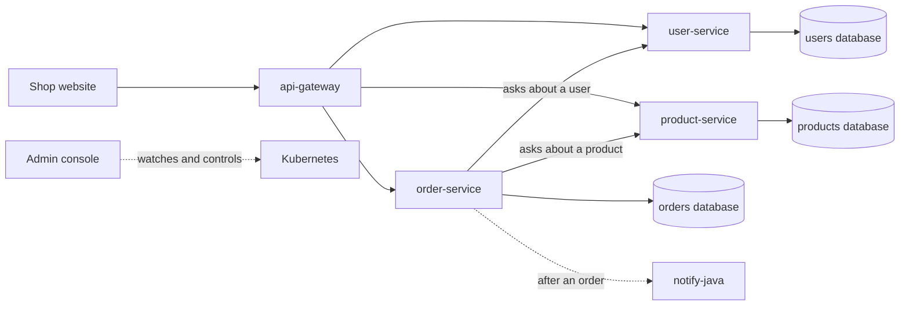

# DEPOT: the backend of a small online shop

This is the backend of an online shop called DEPOT. I built it to learn how cloud systems work, by building the parts myself and measuring them.

It is made of three small services instead of one big program. Each service does one job and has its own database. They run on Kubernetes on my laptop (using Minikube).

There are two other projects that use this backend:

- **The shop website** (repo `Demo-Severless-FE`): what customers see.
- **The admin console** (repo `Demo-Platform-Admin`): where I watch and control the system.

## What it can do

- **Sell things.** Users, products, carts and orders all work.
- **Fix itself.** If a copy of a service dies, Kubernetes starts a new one, and shoppers do not notice.
- **Grow when busy.** product-service gets one more copy when it is under load, and loses it again when things are quiet.
- **Sleep when idle.** Two small functions run zero copies until someone calls them. This saves resources, but the first call is slow. I measured how slow.
- **Give clear errors.** A wrong request gets a short, readable message instead of a crash.
- **Not keep the customer waiting.** After an order, a notification is sent in the background. The customer gets their answer first.

## The parts

| Part | What it does | Its data |
|---|---|---|
| `user-service` | Users and their delivery address | PostgreSQL |
| `product-service` | The product list, prices and stock | MongoDB |
| `order-service` | Carts and orders | PostgreSQL |
| `api-gateway` | The one front door to the three services | none |
| `notify-java` | A small function that receives "order placed" messages (Java) | none |
| `notify-go` | The same function, written in Go | none |



## Three front doors

Each of the three projects has exactly one address.

| What | Address on my laptop | Who uses it |
|---|---|---|
| Backend | `http://localhost:8000` | Me, for testing |
| Shop website | `http://localhost:8080` | Customers |
| Admin console | `http://localhost:5174` | Only me |

The three services cannot be reached from outside directly. Everything goes through the gateway. The shop website sends its requests to the gateway too.

## How the main ideas work

**One database per service.** No service looks inside another service's database. When order-service needs a product's price, it asks product-service. This keeps the services independent.

**Prices are copied into the order.** When you buy something, the order keeps the name and price from that moment. If the price changes later, your old order stays correct.

**Self-healing.** I tell Kubernetes "keep 2 copies of product-service running". It checks all the time. If one copy disappears, it starts another. Three things make this invisible to shoppers:

1. A new copy gets no requests until it says it is ready.
2. A copy that is being stopped waits 5 seconds first, so no new requests are sent to it.
3. It finishes the requests it already has before it exits.

I tested this by sending a request every 0.2 seconds while deleting a copy. Out of 194 requests, 0 failed. The new copy was ready in about 12 seconds.

**Growing when busy.** A rule watches how hard product-service is working. Above 80% CPU it adds a third copy. After a quiet minute it goes back to 2.

**Sleeping functions and the "cold start".** `notify-java` and `notify-go` run zero copies when nobody calls them. The first call has to wait for a copy to start. That wait is called a cold start. See the numbers below.

**The customer does not wait for the notification.** order-service saves the order, answers the customer, and only then calls `notify-java`. In my test the order came back in about 1 second, and the notification arrived about 6 seconds later. If the function is down, the order still succeeds.

**Clear errors.** Every error is a small piece of JSON with a status and a message:

| Status | Meaning | Example |
|---|---|---|
| 404 | Not found | The product or user does not exist |
| 400 | The request is wrong | No quantity was given, or the cart is empty |
| 503 | Something it depends on is down | order-service cannot reach product-service |

## What I measured: cold starts

The same function in two languages, on the same machine. Each number is the middle value of several runs.

| Function | First call after sleeping | Calls after that | With one copy kept awake | Size |
|---|---|---|---|---|
| Java (`notify-java`) | 3248 ms | 9 ms | 8 ms | 228 MB |
| Go (`notify-go`) | 1013 ms | 6 ms | 6 ms | 7.3 MB |

What this shows:

- Java takes about 3 times longer than Go to wake up.
- Once awake, they are equally fast.
- Keeping one copy always awake removes the wait, but that copy uses resources even when nobody calls it.

That is the trade-off: save resources and make the first user wait, or pay for an idle copy and make nobody wait.

These numbers come from my laptop (Apple M1, 8 GB RAM), measured on 1 October 2026. They are good for comparing Java with Go. They are not what you would get in a real data centre. The raw data is in `docs/results/`.

## Requests you can make

| Area | Requests |
|---|---|
| Users | `GET/POST /users`, `GET/PUT/DELETE /users/{id}`, `GET/PUT /users/{userId}/address` |
| Products | `GET/POST /products`, `GET/PUT/DELETE /products/{id}` |
| Carts | `GET /carts/{userId}`, `POST /carts/{userId}/items`, `DELETE /carts/{userId}/items/{itemId}` |
| Orders | `POST /orders/{userId}`, `GET /orders/{id}`, `GET /orders/user/{userId}` |
| Functions | `POST /notify` |

## API documentation (Swagger)

Each service has its own Swagger page. It lists every request, shows what to send and what comes back, and lets you try a request from the browser.

| Service | Swagger page | Raw description (JSON) |
|---|---|---|
| user-service | `http://localhost:8081/swagger-ui.html` | `http://localhost:8081/v3/api-docs` |
| product-service | `http://localhost:8082/swagger-ui.html` | `http://localhost:8082/v3/api-docs` |
| order-service | `http://localhost:8083/swagger-ui.html` | `http://localhost:8083/v3/api-docs` |

With Docker Compose these addresses work straight away.

On Minikube the Swagger pages are not behind the gateway. The gateway only lets the shop's requests through. So open a door to the service you want first, each in its own terminal:

```bash
kubectl port-forward svc/user-service 8081:8081
kubectl port-forward svc/product-service 8082:8082
kubectl port-forward svc/order-service 8083:8083
```

Then open the Swagger page in your browser.

## How to run it

You need Docker, Minikube and kubectl. Docker should have about 4 GB of memory.

### The simple way: Docker Compose

This runs everything on your machine without Kubernetes.

```bash
docker compose up -d --build
curl localhost:8082/products
```

### The full way: Kubernetes on Minikube

```bash
minikube start --cpus=4 --memory=3600
./scripts/install-knative.sh     # only once for a new cluster
./scripts/deploy.sh              # builds and starts everything
```

`deploy.sh` starts the databases, builds the services, puts them into Minikube and starts them. If a download fails half-way, just run it again.

Check that everything is up:

```bash
kubectl get pods
```

You should see `product-service` twice, and `user-service`, `order-service` and `api-gateway` once each, all `Running`.

Open the backend's front door:

```bash
kubectl port-forward svc/api-gateway 8000:80
```

Then, in another terminal:

```bash
curl localhost:8000/products
curl localhost:8000/users
```

## Try it yourself

**Watch it heal.** Delete one copy of product-service and watch a new one appear:

```bash
kubectl get pods -l app=product-service
kubectl delete pod <one of the two names>
kubectl get pods -l app=product-service -w
```

**Wake a sleeping function.** Open the door to the functions, then call one. The first call takes a second or more, the second call is instant:

```bash
kubectl port-forward -n kourier-system svc/kourier 8091:80
```

```bash
curl -s -o /dev/null -w '%{time_total}s\n' -X POST -H "Host: notify-go.default.127.0.0.1.sslip.io" -d 'hello' http://127.0.0.1:8091/notify
```

**Run all the cold-start measurements.** This takes about 10 minutes:

```bash
./scripts/coldstart.sh
```

## What is not done yet

I want to be honest about the limits.

- Everything runs on one laptop. If the laptop stops, the whole system stops.
- The databases run outside Kubernetes and have no backup copy.
- Only product-service has health checks and a second copy. The other two services have one copy each.
- There is no login. Anyone who can reach it can use it.
- The notification is sent once. If it fails, it is not tried again.
- Stock is stored but not checked when you order.
- There are almost no automated tests.

## What I want to add next

- A record of who did what. The admin console can already stop a copy of a service, wake a function, keep one awake and start a load test. But there is no login, and nothing writes down who did which action or when. I want to move these actions into a small control panel service of my own, add scale and restart, and keep a log of every action.
- A message queue (RabbitMQ), so notifications are never lost.
- Waking a function just before it is needed, instead of always or never.
- A faster-starting Java function (GraalVM), to see how close it gets to Go.
- Login and proper security.

## Where things are

```
user-service/  product-service/  order-service/   the three services
notify-java/   notify-go/                         the two functions
k8s/                                              Kubernetes files for the services and the gateway
k8s/knative/                                      Kubernetes files for the functions
scripts/                                          deploy, install Knative, measure cold starts
docs/                                             notes, work log and results
docker-compose.yml                                the databases
```

Built with Java 21, Spring Boot 4.1, Kubernetes 1.37 (Minikube), Knative 1.23 and nginx.


